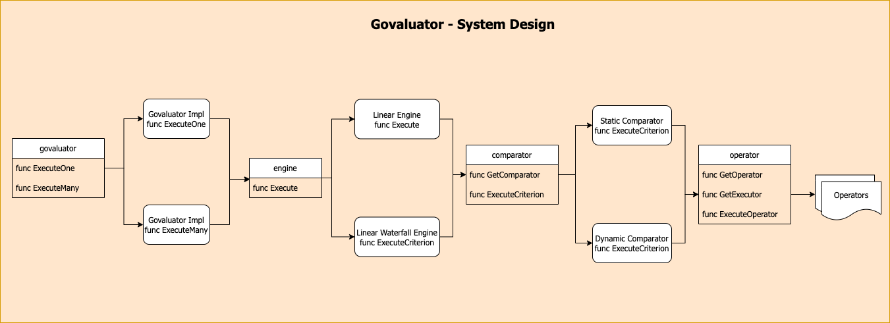

# Govaluator

---

[]


Govaluator is a data model agnostic state less in-memory rule engine library. Govaluator is designed to
work with any ```map[string]interface{}``` type as the data model. The data set can be evaluated against
a single rule or multiple rules.

## Glossary

1. [Purpose](#purpose)
2. [Features](#features)
3. [Usage](#usage)
4. [Future Road Map](#future-road-map)
5. [Issue Tracker](https://github.com/isomnath/govaluator/issues)

## Purpose

The library provides a strongly typed DSL for creating, managing and validating rules. The DSL provides
a basis to build a simple UI on top of the consuming application and thus making the rule engine 
self-served for the end user (target user being from non-tech background)

## Features

The library currently features 2 types of rule engines:
```
1. LINEAR
2. LINEAR_WATERFALL
```

For each type of engine there are 2 type of comparators available:
```
1. STATIC
2. DYNAMIC
```

For each type of comparator there are 62 operators of logical comparison:
```
/*
	Time value comparison operator names
*/
1. BEFORE
2. AFTER
3. DURING

/*
	Value comparison operator names
*/
4. EQUALS
5. NOT_EQUALS
6. LESS_THAN
7. LESS_THAN_OR_EQUAL_TO
8. LESS_THAN_ANY
9. LESS_THAN_OR_EQUAL_TO_ANY
10. LESS_THAN_NONE
11. LESS_THAN_OR_EQUAL_TO_NONE
12. LESS_THAN_ALL
13. LESS_THAN_OR_EQUAL_TO_ALL
14. GREATER_THAN
15. GREATER_THAN_OR_EQUAL_TO
16. GREATER_THAN_ANY
17. GREATER_THAN_OR_EQUAL_TO_ANY
18. GREATER_THAN_NONE
19. GREATER_THAN_OR_EQUAL_TO_NONE
20. GREATER_THAN_ALL
21. GREATER_THAN_OR_EQUAL_TO_ALL
22. BETWEEN
23. NOT_BETWEEN
24. ANY_OF
25. NONE_OF
26. REGEX_MATCH
27. REGEX_NOT_MATCH

/*
	Slice comparison operator names
*/
28. UNORDERED_EQUALS
29. UNORDERED_NOT_EQUALS
30. ORDERED_EQUALS
31. ORDERED_NOT_EQUALS
32. ANY_LESS_THAN
33. ANY_LESS_THAN_OR_EQUAL_TO
34. NONE_LESS_THAN
35. NONE_LESS_THAN_OR_EQUAL_TO
36. ALL_LESS_THAN
37. ALL_LESS_THAN_OR_EQUAL_TO
38. ANY_GREATER_THAN
39. ANY_GREATER_THAN_OR_EQUAL_TO
40. NONE_GREATER_THAN
41. NONE_GREATER_THAN_OR_EQUAL_TO
42. ALL_GREATER_THAN
43. ALL_GREATER_THAN_OR_EQUAL_TO
44. REVERSED_BETWEEN
45. REVERSED_NOT_BETWEEN
46. SUPERSET_OF
47. NOT_SUPERSET_OF
48. SUBSET_OF
49. NOT_SUBSET_OF
50. INTERSECTION
51. NOT_INTERSECTION
52. REVERSED_ANY_OF
53. REVERSED_NONE_OF
54. SIZE_EQUALS
55. SIZE_NOT_EQUALS
56. SIZE_LESS_THAN
57. SIZE_LESS_THAN_OR_EQUAL_TO
58. SIZE_GREATER_THAN
59. SIZE_GREATER_THAN_OR_EQUAL_TO
60. ANY_REGEX_MATCH
61. NONE_REGEX_MATCH
62. ALL_REGEX_MATCH
```

## System Design



## Usage

Initialize govaluator interface:

V1 Interface:

```go
    package someapp

    import (
    	govaluator "github.com/isomnath/govaluator/v1"
    )

    // Initialize Library
    g := govaluator.Initialize()
    
    // Fetch supported Data Types
    dataTypes := g.GetAllDataTypes()

    // Fetch available operators for a given data type 
    operators := g.GetOperatorsByDataType(dataType)

    // Get available comparators 
    comparators := g.GetComparators()

    // Get available engines 
    engines := g.GetEngines()

    // Execute one rule  - data (map[string]interface{} and rule (models.Rule{})
    result, err := g.ExecuteOne(data, rule)

    // Execute many rules  - data (map[string]interface{} and rules ([]models.Rule{})
    results, err := g.ExecuteMany(data, rules)
```

Sample Rule JSONs available:
1. [Linear](docs/rule_samples/linear.json)
2. [Linear Waterfall](docs/rule_samples/linear_waterfall.json)

## Result Model
```go
package models

type Result struct {
	Success bool        `json:"success"`
	Data    *ResultData `json:"data"`
	Errors  []error     `json:"errors"`
}

type ResultData struct {
	ID          string      `json:"id"`
	Name        string      `json:"name"`
	Description string      `json:"description"`
	Remark      string      `json:"remark"`
	Engine      string      `json:"engine"`
	Value       interface{} `json:"value"`
}
```

### Successful result object sample
```go
package sample

result := models.Result{
	Success: true,
	Rule: models.RuleMetadata {
            ID:          "Sample ID",
            Name:        "Sample Name",
            Description: "Sample Description",
            Engine:      "LINEAR | LINEAR_WATERFALL",
	},
	Data: &models.ResultData {
            Remark:      "Parsed Remark",
            Value:       true,	
    }
}
```

### Error result object sample
```go
package sample

result := models.Result{
	Success: false,
	Rule: models.RuleMetadata {
            ID:          "Sample ID",
            Name:        "Sample Name",
            Description: "Sample Description",
            Engine:      "LINEAR | LINEAR_WATERFALL",
	},
	Errors: []error{fmt.Errorf("some error")}
}
```

## Future Road Map

1. Expose interface to allow validation of rule configurations
2. Expose interface to unmarshal JSON based rules into the structure
3. Enable data dog tracing - Tracing rule evaluation status, errors(if any) and latency
4. Implement 2 more engine types - NON_LINEAR and NON_LINEAR_WATERFALL
5. Implement parallel processing of rules

